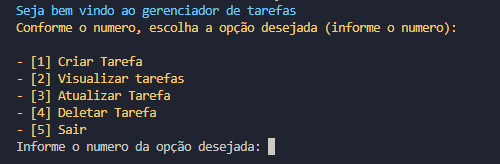

# Gerenciador de Tarefas

  

Este projeto é um gerenciador de tarefas simples implementado em Python. Ele permite que você adicione, visualize, atualize e delete tarefas, além de marcar como concluídas ou não. A aplicação também utiliza a biblioteca `colorama` para imprimir mensagens coloridas no terminal.

## Funcionalidades

- **Adicionar Tarefa**: Permite adicionar novas tarefas (não duplicadas) à lista.
- **Visualizar Tarefas**: Exibe todas as tarefas com seus status (finalizada ou não).
- **Atualizar Tarefa**: Atualiza o nome de uma tarefa ou altera o status de "não finalizada" para "finalizada" e vice-versa.
- **Deletar Tarefa**: Exclui uma tarefa da lista.

## Tecnologias Utilizadas

- **Python 3.x**: Linguagem de programação usada no projeto.
- **Colorama**: Biblioteca utilizada para adicionar cores às mensagens exibidas no terminal.
